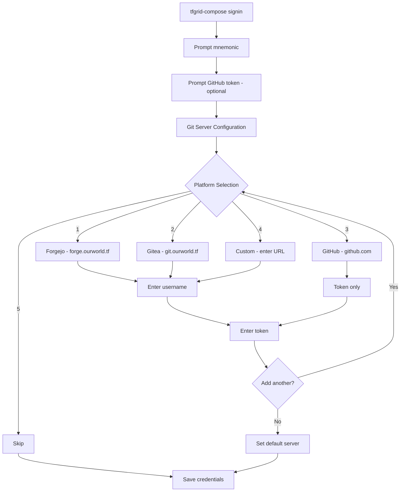
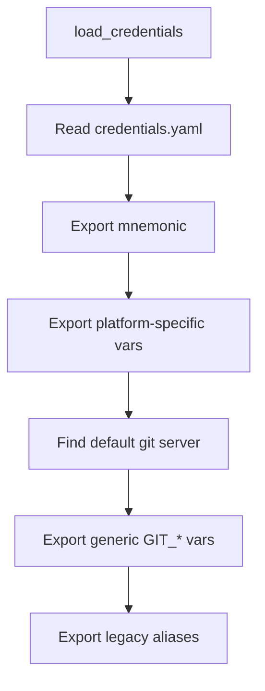

# Multi-Platform Git Support for tfgrid-compose

## Overview

This document outlines the plan to add **multi-platform git support** to `tfgrid-compose`, aligning it with the flexibility already implemented in the `gits` repository.

### Goal
Enable tfgrid-compose to work with multiple git platforms:
- **GitHub** (`github.com`)
- **Gitea** (`git.ourworld.tf`)
- **Forgejo** (`forge.ourworld.tf`)
- **Custom servers**

### Background
- The `gits` tool supports all four platform types with interactive selection
- `tfgrid-compose` currently only supports Gitea credentials
- Real deployments like `zdfz-stack` already use generic variables (`GIT_OURWORLD_USERNAME/TOKEN`) for flexibility

## Reference Implementation: `gits`

The `gits` repository demonstrates multi-platform support:

1. **Platform Selection Menu**: Interactive choice between Forgejo, Gitea, GitHub, Custom
2. **Multiple Server Storage**: Token caching per server in `~/.config/gits/tokens.conf`
3. **Platform Detection**: `detect_platform()` auto-detects from git remote URL
4. **Default Servers**:
   - Forgejo: `forge.ourworld.tf`
   - Gitea: `git.ourworld.tf`
   - GitHub: `github.com`

## Credential Storage Design

### Current State (tfgrid-compose)

```yaml
# ~/.config/tfgrid-compose/credentials.yaml
mnemonic: "..."
github:
  token: "ghp_xxx"
gitea:
  url: "https://git.ourworld.tf"
  token: "xxx"
```

### Proposed State (Multi-Server)

```yaml
# ~/.config/tfgrid-compose/credentials.yaml
mnemonic: "..."

# Multiple git servers supported
git_servers:
  - name: forge.ourworld.tf
    platform: forgejo
    username: myuser
    token: xxx
    default: true
    
  - name: git.ourworld.tf
    platform: gitea
    token: yyy
    
  - name: github.com
    platform: github
    token: zzz

# Legacy support (deprecated, read-only)
github:
  token: "ghp_xxx"
gitea:
  url: "https://git.ourworld.tf"
  token: "xxx"
```

### Environment Variable Exports

When loading credentials, tfgrid-compose will export:

```bash
# Generic variables (for deployments like zdfz-stack)
GIT_SERVER=forge.ourworld.tf         # Default/selected server
GIT_USERNAME=myuser
GIT_TOKEN=xxx

# Platform-specific (backward compatibility)
TFGRID_GITHUB_TOKEN=zzz
TFGRID_GITEA_URL=https://git.ourworld.tf
TFGRID_GITEA_TOKEN=yyy
TFGRID_FORGEJO_URL=https://forge.ourworld.tf
TFGRID_FORGEJO_TOKEN=xxx

# Legacy aliases
GIT_OURWORLD_USERNAME=myuser         # For existing deployments
GIT_OURWORLD_TOKEN=xxx
```

## Files to Update

### Phase 1: Core Credential Management

| File | Changes |
|------|---------|
| `core/signin.sh` | Add multi-server git configuration with platform selection menu |
| `core/common.sh` | Add `load_git_credentials()` function for generic exports |

#### `signin.sh` Changes

**New Functions:**
```bash
# Platform selection menu (like gits)
prompt_git_platform() {
    echo "Which git platform would you like to configure?"
    echo "1) Forgejo (forge.ourworld.tf)"
    echo "2) Gitea (git.ourworld.tf)"
    echo "3) GitHub (github.com)"
    echo "4) Custom server"
    echo "5) Skip git configuration"
    read -r choice
    # ... handle choice
}

# Add a git server
add_git_server() {
    local platform="$1"
    local server="$2"
    local username="$3"
    local token="$4"
    # ... add to credentials.yaml
}

# List configured servers
list_git_servers() {
    # ... parse and display git_servers from credentials
}

# Set default server
set_default_git_server() {
    local server="$1"
    # ... update default flag
}
```

**Updated Flow:**
```
tfgrid-compose signin
├── Prompt for mnemonic (existing)
├── Prompt for GitHub token (existing, optional)
├── NEW: Git server configuration
│   ├── Platform selection menu
│   ├── Server URL (with defaults per platform)
│   ├── Username (optional for some platforms)
│   └── Token
│   └── "Add another server?" prompt
└── Save credentials
```

### Phase 2: Git Configuration Context

| File | Changes |
|------|---------|
| `core/gitconfig.sh` | Add `forgejo` context alongside `github` and `gitea` |

**Add Forgejo Context:**
```bash
# Contexts for conditional git includes
echo "  github          - For ~/code/github.com/ repos"
echo "  gitea           - For ~/code/git.ourworld.tf/ repos"  
echo "  forgejo         - For ~/code/forge.ourworld.tf/ repos"  # NEW
echo "  tfgrid-ai-agent - For ~/code/tfgrid-ai-agent-projects/ repos"
```

### Phase 3: Deployment Integration

No changes needed! Deployments like `zdfz-stack` already use generic variables:

```bash
# zdfz-stack/deployment/setup.sh (already works)
GIT_OURWORLD_USERNAME="${GIT_OURWORLD_USERNAME:-}"
GIT_OURWORLD_TOKEN="${GIT_OURWORLD_TOKEN:-}"
GITEA_SERVER="forge.ourworld.tf"  # Hardcoded to Forgejo
```

The generic `GIT_*` exports from signin will populate these automatically.

### Phase 4: Documentation Updates

| File | Changes |
|------|---------|
| `README.md` | Update to mention multi-platform support |
| `docs/AI_AGENT_GUIDE.md` | Update environment variable examples |
| `docs/QUICKSTART.md` | Add git server configuration section |

## Implementation Details

### Sign-in Flow Diagram



### Credential Loading Flow



## Backward Compatibility

1. **Legacy Credentials**: Old `gitea:` section is still read and exported
2. **Legacy Variables**: `TFGRID_GITEA_*` continue to work
3. **Deprecation Warnings**: Log when legacy format detected
4. **Migration Path**: Encourage users to re-run `signin` for new format

## Testing Checklist

- [ ] `tfgrid-compose signin` allows configuring multiple git servers
- [ ] Generic `GIT_*` variables exported correctly
- [ ] `zdfz-stack` deployment works with new credentials
- [ ] Legacy `gitea:` credentials still work
- [ ] `gitconfig --context=forgejo` creates correct conditional includes
- [ ] Platform detection works for all server types

## Implementation Order

1. **Update `signin.sh`** - Add multi-server support with platform menu
2. **Update credential loading** - Export generic and platform-specific variables
3. **Update `gitconfig.sh`** - Add forgejo context
4. **Test with zdfz-stack** - Verify deployment works
5. **Update documentation** - Reflect new capabilities

## Summary

The key changes are:

1. **`signin.sh`**: Add platform selection menu and multi-server storage
2. **Credential exports**: Add generic `GIT_*` variables alongside platform-specific ones
3. **`gitconfig.sh`**: Add `forgejo` context
4. **No deployment changes needed**: Generic variables already supported

This approach provides maximum flexibility while maintaining backward compatibility.
